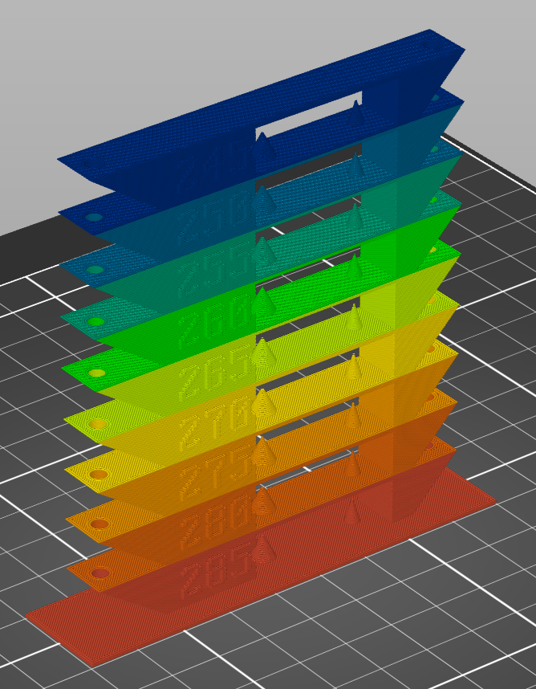
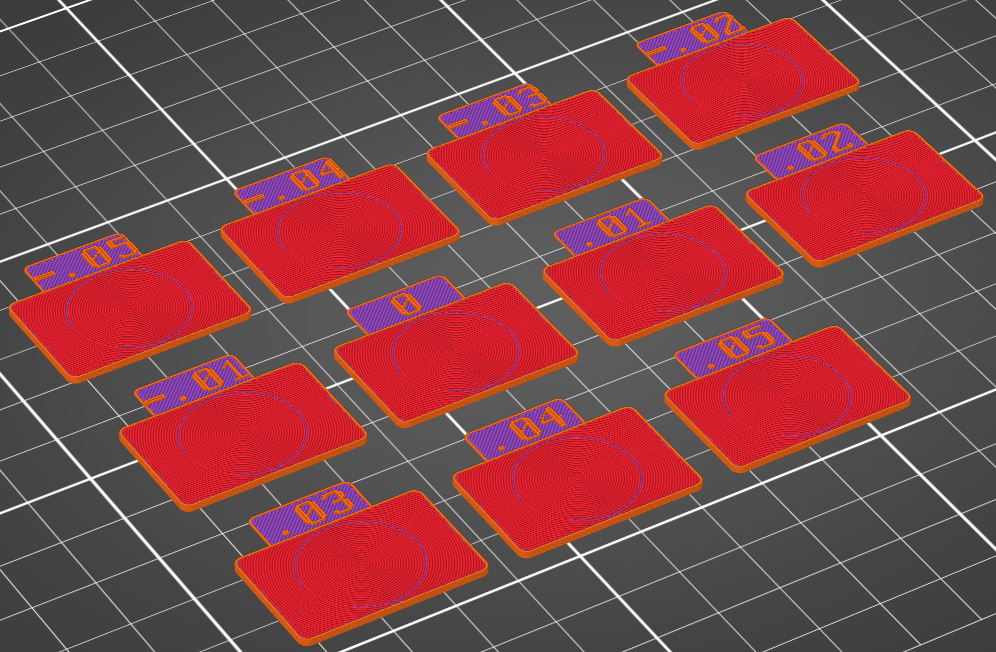
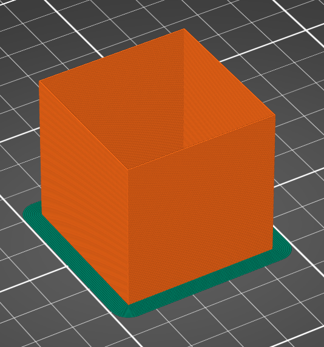
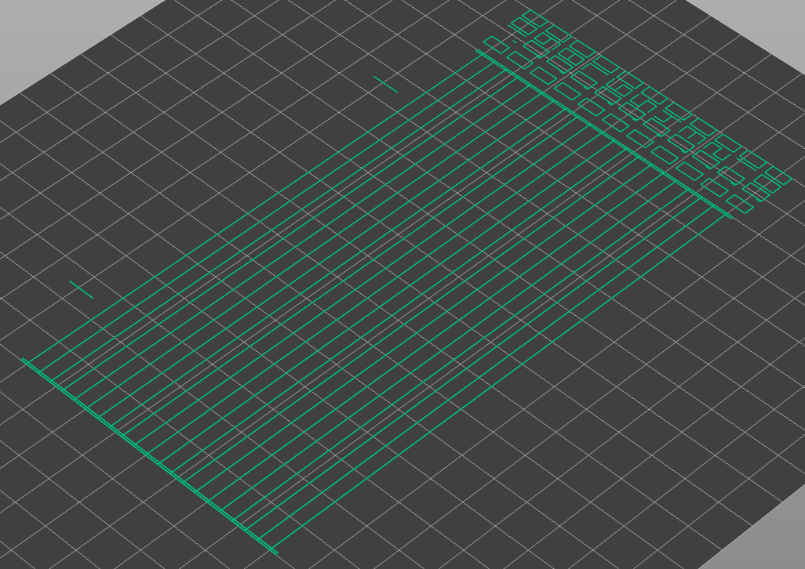
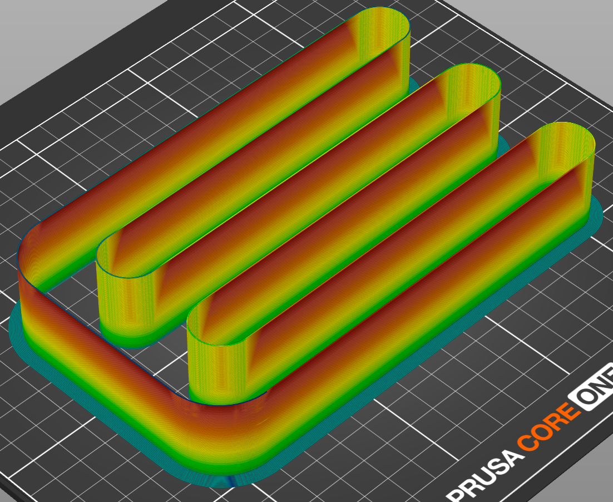
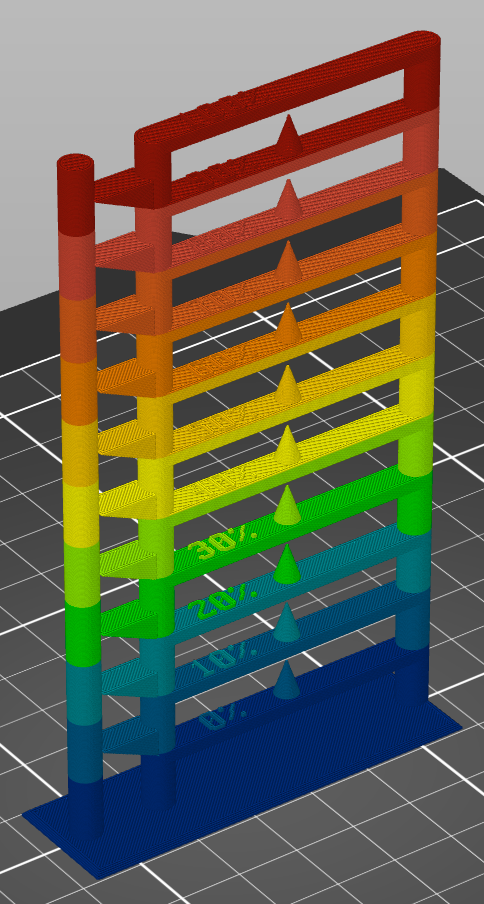
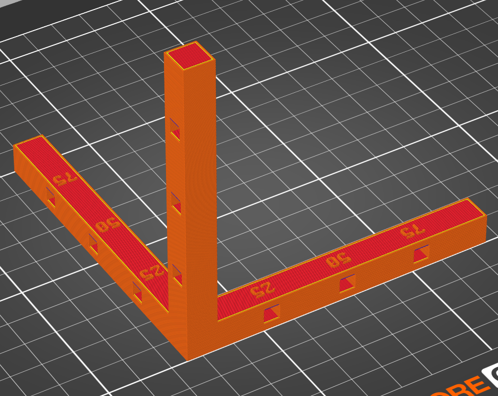

# Calibration Guide

This guide explains the calibration tools available in the **Calibration** menu and how to use each one to tune your printer and filament settings.

## Recommended order

Run the calibrations in this order — each one builds on the results of the previous. The menu is laid out in the same order:

| # | Test | Menu location |
|---|------|---------------|
| 1 | Temperature Tower | Calibration → **Temperature** |
| 2 | Flow Ratio | Calibration → **Flow Ratio** → *YOLO* / *Extrusion Multiplier* |
| 3 | Pressure Advance | Calibration → **Pressure Advance** (Tower / Line) |
| 4 | Retraction | Calibration → **Retraction** |
| 5 | Max Volumetric Flow Rate | Calibration → **Max FlowRate** |
| 6 | Fan Speed | Calibration → **Fan Speed** |
| 7 | Dimensional Accuracy | Calibration → **Dimensional Accuracy** → *XYZ Shrinkage Gauge* / *Califlower* |
| — | XY Skew Correction | Printers → General (a one-time printer setting, §8) |
| — | Bed Mesh | Calibration → **Bed Mesh** (diagnostic, §9) |

> **About the screenshots:** example images live in `doc/images/` and are referenced as ``. If an image is missing, generate that test, frame the bed, and save a screenshot to the indicated path.

---

## Applying a result — where each value goes

Each test section ends with an **Apply the result** step that names the exact setting to change. The table below collects them. Paths read *tab → page → group*, using the tab names shown in the top bar: **Print Settings**, **Filaments** and **Printers**.

> **Before you apply a result**
>
> - **The tests change your presets.** Every test in §1–§7a temporarily changes the **Print Settings** preset (brim, speeds, layer height, …). YOLO, PA Line and Retraction also change the **Printers** preset (for example *Supports binary G-code* off and *Use relative E distances* on). Fan, PA Tower and Retraction also change the **Filaments** preset (fan, slowdown and retraction settings). All of these show up as unsaved changes.
> - **Revert the test changes before you save.** In each changed tab, select the same preset again from its drop-down and choose **Discard**. If no dialog appears, PrusaSlicer is applying a choice you told it to remember, which may keep or even save the test changes: turn on Preferences → *Ask for unsaved changes in presets when selecting new preset* first. The orange back-arrow at the top of a tab only resets the page you are looking at, not the whole tab. If a test change was saved by mistake, set it back and save again. Watch for *Supports binary G-code*: if it was saved switched off, every later print is written as ASCII G-code.
> - **Save each result before you start the next test.** Starting a test discards unsaved changes. Every test discards unsaved Print Settings edits. PA Tower and Retraction also discard unsaved Filaments edits, and YOLO and Retraction discard unsaved Printers edits. The safe order is: revert the test changes → enter the result → save → run the next test.
> - **Some settings only appear in Advanced or Expert mode.** The *Mode* column below says which mode shows each one. Switch modes with the button at the top right of the window. It reads *Beginner mode*, *Normal mode* or *Expert mode*, which this guide calls Simple, Advanced and Expert.
> - **System presets are read-only.** Saving changes to a system preset (for example a Prusament filament) asks for a new name and creates a user preset. Keep that user preset selected from then on.
> - **To find a setting by name,** use the search box in the top bar or **Edit → Search** (Ctrl+F, or ⌘F on macOS).
> - **If you use FilamentDB:** the per-nozzle values FilamentDB stores for a filament (extrusion multiplier, pressure advance, max volumetric speed and retraction) are re-applied whenever a printer preset loads, and they replace what you entered. Saving a filament preset also sends it to FilamentDB, and a notification on the Plater says whether that worked. Make sure FilamentDB ends up with the new values too, or the old ones come back. Check pressure advance in particular, and any retraction length you set on the Printers tab: it is not part of the filament preset, so saving the filament does not send it, and FilamentDB's stored retraction overrides it.

| Test | Setting to change | Where to find it | Mode |
|------|-------------------|------------------|------|
| [1. Temperature Tower](#1-temperature-tower) | **Other layers** (optionally **First layer**) | Filaments → Filament → Temperature → *Nozzle* row | Simple |
| [2. Flow Ratio](#2-flow-ratio) (YOLO or vase cube) | **Extrusion multiplier** | Filaments → Filament → Filament | Advanced |
| [3. Pressure Advance](#3-pressure-advance) | The PA command in **Start G-code** | Filaments → Custom G-code → Start G-code | Expert |
| [4. Retraction](#4-retraction), per filament (recommended) | **Retraction length** (tick its checkbox) | Filaments → Filament Overrides → Retraction | Simple |
| [4. Retraction](#4-retraction), default for every filament | **Retraction length** | Printers → Extruder 1 → Retraction | Simple |
| [5. Max Volumetric Flow Rate](#5-max-volumetric-flow-rate) | **Max volumetric speed** | Filaments → Advanced → Print speed override | Advanced |
| [6. Fan Speed](#6-fan-speed) | **Keep fan always on** | Filaments → Cooling → Enable | Simple |
| [6. Fan Speed](#6-fan-speed) | **Min** and **Max** (*Fan speed* row), **Bridges fan speed** | Filaments → Cooling → Fan settings | Expert |
| [7a. XYZ Shrinkage Gauge](#7a-xyz-shrinkage-gauge) | **Shrinkage compensation XY** and **Shrinkage compensation Z** | Filaments → Advanced → Shrinkage compensation | Advanced |
| [7b. Califlower](#7b-califlower) | Depends on the correction (see §7b) | — | — |
| [8. XY Skew Correction](#8-xy-skew-correction) | **XY Skew Correction** | Printers → General → Skew Correction | Expert |
| [9. Bed Mesh](#9-bed-mesh-visualization) | Nothing: the bed mesh is diagnostic only | — | — |

---

## 1. Temperature Tower



**What it does:** Generates a multi-tier tower where each tier is printed at a different nozzle temperature. The tower includes overhangs (45° and 35°), bridging gaps, vertical and horizontal holes, cones, and a surface protrusion bar — all features that are sensitive to temperature.

**How to use it:**

1. Go to **Calibration → Temperature**.
2. Set the start temperature (highest, bottom tier), end temperature (lowest, top tier), and step size.
   - Defaults are read from your currently selected filament profile.
   - A step of 5°C is typical.
3. Optionally enable the 5 mm brim for better bed adhesion.
4. Click OK. The tower will appear on the bed with per-layer temperature commands already set.
5. Slice and print.

**How to evaluate:**

Examine each tier for:

- **Overhangs**: Look for drooping or curling on the 45° and 35° angled surfaces. Lower temperatures generally improve overhang quality.
- **Bridging**: Check the gap between the cutout walls. Strings or sag indicate the temperature is too high.
- **Stringing**: Look at the cones and holes. Fine strings between features mean the temperature is too high.
- **Layer adhesion**: Try snapping a tier off. If layers separate easily, the temperature is too low.
- **Surface quality**: Check the flat surfaces and the protrusion bar. Rough or blobby surfaces suggest too-high temperature.

Choose the tier that shows the best overall balance.

**Apply the result:** set Filaments → Filament → Temperature → *Nozzle* row → **Other layers** to the winning tier's temperature. **First layer**, on the same row, is usually set to the same value or a few degrees higher. Save the preset.

---

## 2. Flow Ratio

Flow ratio (a.k.a. the extrusion multiplier) sets how much plastic the printer lays down. Two tests under **Calibration → Flow Ratio** measure the same thing — use whichever you prefer:

- **YOLO** — flat pads, each at a slightly different flow; pick the smoothest top by eye (fast).
- **Extrusion Multiplier** — a single-wall vase cube whose wall thickness you measure with calipers (more precise).

### 2a. YOLO (flat pads)



**What it does:** Generates 11 flat rectangular pads (30×20 mm) with label tabs, each printed at a different extrusion multiplier (from -.05 to +.05 in .01 steps). The top layer uses an Archimedean Chords spiral pattern over a solid monotonic base. When connected to a FilamentDB server, nozzle-specific calibration data (PA, max volumetric speed, retraction) is automatically applied when you switch printer presets.

**How to use it:**

1. Go to **Calibration → Flow Ratio → YOLO**.
2. Adjust the number of steps (default 5 each side), step percentage (default 1%), and pad dimensions.
3. Click OK. The pads will appear arranged on the bed, each labelled with its flow modifier (e.g., `-.03`, `0`, `.02`).
4. Slice and print.

**How to evaluate:**

1. Examine the **top surface** of each pad (the spiral pattern):
   - **Too little flow** (negative pads): gaps between spiral arcs, rough surface
   - **Too much flow** (positive pads): material buildup at the inner spiral, ridged surface
   - **Correct flow**: smooth, flat, uniform top surface with clean spiral arcs
2. Run your finger across the pads — the correct one feels smoothest.
3. Note the winning pad's modifier, which is the number on its label tab (`.02` means +2 %).

**Why the pads can look similar — and how the flow is actually changed:**

- The per-pad flow is applied by an in-process post-processor that scales the **extrusion amount (`E`) of each pad** by its multiplier, keyed on the pad's object label. There is **no `M221`/flow command in the G-code to look for** — the difference lives in the per-pad `E` values. To confirm it is working, export the G-code and compare an `E` value on a move of the `-.05` pad with the same move on the `+.05` pad: they differ by ~10%.
- With the default **1% step**, neighbouring pads differ by only 1% of flow, which on a well-tuned filament can be genuinely hard to distinguish by eye. Compare the **extremes first** (`-.05` vs `+.05`) to find the direction, then narrow in. If you want larger, more obvious differences between pads, raise the **step percentage**.

> Note: in PrusaSlicer Filament Edition **1.7.x** a bug made every pad print at identical flow; this was fixed in **1.8.0**. If you are on an older build, update before running this test.

**Apply the result:** each pad's flow is your current extrusion multiplier scaled by (1 + modifier), so:

```
new_multiplier = current_multiplier × (1 + modifier)
```

For example, if `.02` looks best and your current multiplier is 0.98, the new value is 0.98 × 1.02 ≈ 1.00. Simply adding the modifier to the current multiplier gives almost the same number. Enter the new value in Filaments → Filament → Filament → **Extrusion multiplier** (Advanced mode). Save the preset.

### 2b. Extrusion Multiplier (vase cube)



**What it does:** Generates a 40×40×40 mm cube printed in spiral vase mode with a single classic perimeter and no bottom layers. This produces a single-wall box whose thickness you can measure directly.

**How to use it:**

1. Go to **Calibration → Flow Ratio → Extrusion Multiplier**.
2. Optionally enable or disable the 5 mm brim.
3. Click OK. The cube will appear with vase mode and classic perimeters already configured.
4. Slice and print.

**How to evaluate:**

1. After printing, use digital calipers to measure the wall thickness at several points around the cube, at mid-height. Avoid corners and the seam.
2. Take 4-8 measurements and average them.
3. Calculate the new extrusion multiplier:

```
new_multiplier = expected_width / measured_width × current_multiplier
```

`expected_width` is the wall width the slicer planned. Slice the cube, open the **Preview**, switch the legend's view to **Width (mm)** and read the wall's width at mid-height. For the exact value of one move, use the **Show properties** button on the tool-position bar at the bottom of the Preview (the bar appears once you drag the horizontal slider back from its end). The configured value lives in Print Settings → Advanced → Extrusion width → **External perimeters**, but that field can be 0 (automatic) or a percentage, so the Preview is the more reliable source.

4. Apply the new multiplier (below) and re-print to verify.

**Apply the result:** enter `new_multiplier` in Filaments → Filament → Filament → **Extrusion multiplier** (Advanced mode). This is the same field as in §2a. Save the preset.

---

## 3. Pressure Advance



**What it does:** Runs a Pressure Advance test where different parts of the print use different PA values. Pressure Advance compensates for the delay between the extruder motor pushing filament and it actually flowing from the nozzle.

**Test styles** (choose in the dialog's *Test style* dropdown):

- **Chevron tower** *(default)* — a tall tower of nested V-shapes; PA changes once per layer group. Read the result by height.
- **Line — K-factor speed test** — the [garethky / Marlin K-factor](https://github.com/garethky/PrusaSlicerPressureAdvanceCalibration) line method: one straight line per PA value, each printed **slow → fast → slow** between left/right **anchor bars**, with two reference **ticks** above the pattern at the slow/fast boundaries. The lines and bars print as one piece (lift it off the plate by a bar). Read bead consistency at the speed transitions. *This style is a generated tool path — see the note below.* (Recommended for input-shaper printers — Core One, MK4, MK3.9, XL — where it reads more clearly than a corner test.)
  - **Print PA value labels** *(Line style only, on by default)* prints the PA value to the right of every few lines. The digits are drawn stroke by stroke, so they come off as many small separate pieces when you remove the test (the two reference ticks are separate pieces too). If they are a nuisance — for example, if they scatter when scraped off a textured or satin sheet — untick the option: a short stub past the right bar then marks the front line and every few lines after it instead, printed as one piece with the lines and bars, so you can still count lines. The whole test is centred on the bed and must fit with a 5 mm margin on each side: it is about 169 mm wide with labels and 155 mm without (0.4 mm nozzle), so its width fits a MINI either way. Its depth grows by 4 mm per line, so a long sweep may need a larger step to fit a small bed.

> **The Line style is a generated tool path, not a sliced shape.** When you slice, the on-screen preview shows only a small **placeholder** — the real pattern is spliced in when the G-code is written. **Export the G-code, then open the exported file in the G-code viewer to see the actual pattern.** A reminder pops up after slicing; tick *"Don't show this again"* to silence it.

**How to use it:**

1. Go to **Calibration → Pressure Advance** and pick a **Test style**.
2. Set the start PA, end PA, and step size.
   - For direct drive extruders, try 0.0 to 0.1 with a step of 0.005.
   - For Bowden extruders, try 0.0 to 2.0 with a step of 0.05.
3. Set the **Test Speed** (default 100 mm/s). PA differences only become visible at high print speeds because the corner pressure spike scales with extrusion rate. The dialog overrides the print preset's perimeter / infill / gap-fill speeds to this value, and the filament preset's `slowdown_below_layer_time` is set to 0 so PrusaSlicer's cooling logic doesn't slow the thin chevron layers down. Without these overrides, every PA value tends to produce indistinguishably blurry corners.
4. Optionally enable the 5 mm brim for better bed adhesion (Chevron tower only — the Line style prints its own anchor bars and always turns the brim off).
5. Click OK. The test geometry appears on the bed with the PA commands wired up (auto-detected for your firmware).
6. After slicing, **verify the actual speed** in the G-code preview's per-layer info — confirm the perimeters report at or near your test speed and the layer time is short. If the slicer reports something far below your test speed, a volumetric flow limit is capping it — **Filaments → Advanced → Print speed override → Max volumetric speed** or **Print Settings → Speed → Autospeed (advanced) → Max volumetric speed** (the lower one wins); raise it or pick a more compatible filament. (`max_print_speed` only affects autospeed and does not cap the test's explicit speeds.)
7. Print.

**How to evaluate:**

Examine the chevron tips at each height:

- **Too little PA**: The corners will have bulging or rounded tips with excess material.
- **Too much PA**: The corners will show gaps or under-extrusion at the tips, and the lines may be thin.
- **Correct PA**: The chevron tips will be sharp and clean, with consistent line width throughout the arm.

Note the height of the best-looking layer, then calculate the PA value:

```
PA = start_PA + (layer_number / layers_per_level) × step
```

The layer count for each level (default 4 layers) is printed from bottom to top. To use the value, see **Apply the result** at the end of this section.

> **Note:** The test picks the PA command from your printer profile's G-code flavor and printer notes. It uses `M572 S` with Prusa's input-shaper printer profiles (MK4 and XL *Input Shaper*, MK4S, MK3.9, MK3.5, MINI *Input Shaper*, Core One) and on RepRapFirmware and the other non-Marlin flavors. It uses `M900 K` on the MK3S, the MINI, the older non-input-shaper MK4 and XL profiles and other Marlin printers, and `SET_PRESSURE_ADVANCE ADVANCE=` on Klipper.

**Evaluating the Line style:** lines run front-to-back (start PA at the front, end PA at the back), one PA step apart. Each line is printed slow → fast → slow, and the two ticks above the pattern mark the slow/fast boundaries. With labels on, the PA value is printed to the right of every few lines, centred on its line, and always on the last line (except in a 2-line sweep, where only the start PA is labelled). With labels off, count lines from the front: PA = start PA + n × step, where the front line is n = 0. The stubs past the right bar mark the front line and every Nth line after it (the notification after you click OK gives N; it is every 2nd line at the default step). At the correct PA the bead width stays uniform through the speed transitions; too little PA bulges just after the transition, too much leaves a gap. Pick the line that reads most uniform and use its PA.

**Apply the result:** PrusaSlicer has no pressure-advance setting of its own. PA is set by a firmware command in the filament's **Start G-code**. That G-code runs at the start of every print and overrides whatever value the firmware holds, so a PA stored only in the printer's firmware configuration is overwritten on the next print. To change it:

1. Switch to Expert mode and open Filaments → Custom G-code → **Start G-code**.
2. Find the PA command. It is the same command the test used (see the note above):

   | Printer / firmware | PA command |
   |--------------------|------------|
   | Prusa MK4 and XL *Input Shaper*, MK4S, MK3.9, MK3.5, MINI *Input Shaper*, Core One | `M572 S<value>` |
   | Prusa MK3S / MK3S+, MINI, older non-input-shaper MK4 and XL profiles, other Marlin printers | `M900 K<value>` |
   | Klipper | `SET_PRESSURE_ADVANCE ADVANCE=<value>` (a `pressure_advance` value in the `[extruder]` section of `printer.cfg` also works, but a Start G-code command overrides it) |
   | RepRapFirmware (Duet) and other flavors | `M572 S<value>`, which is what the test emits. RepRapFirmware also accepts the extruder-specific form `M572 D0 S<value>`. |

3. Prusa's own filament profiles usually don't hold a single number. They pick one per printer and per nozzle size, so change only the number for **your** printer and nozzle. The Start G-code has one of these shapes:
   - A single `M572 S…` or `M900 K…` line, used on every printer the profile supports.
   - Two branches: `{if printer_notes!~/.*(MK4IS|XLIS|MK4S|MK3.9S|COREONE).*/}` holds an `M900 K…` line for older printers, and the `{else}` branch holds an `M572 S…` line for the MK4 and XL *Input Shaper* profiles, MK4S, MK3.9 and Core One.
   - An `M900 K…` block for the MK3S and MINI, followed by a separate `{if printer_notes=~/.*MINIIS.*/}` block and, in most of these profiles, a separate `{if printer_notes=~/.*MK3.5.*/}` block, each with its own `M572 S…` line.

   Inside your printer's line, each `{if …}` or `{elsif …}` condition is followed by the value used when it matches, and `{else}` by the value used when nothing matches. Change the value whose condition matches your nozzle, for example the `0.036` in `…==0.4}0.036{elsif…` for a 0.4 mm nozzle. On `M900` lines the condition can also name the printer model (`PRINTER_MODEL_MINI`). If your nozzle has no condition of its own, change the value after that line's `{else}`. Some profiles also carry a second `M900 K…` line commented `LA 1.0`, which holds values for old Linear Advance 1.0 firmware; edit the line commented `LA 1.5` instead. Leave the other branches alone, so the preset still works on your other printers.
4. If the Start G-code has no PA line at all, add one on its own line, for example `M572 S0.045` (use your firmware's command). Without one, the printer keeps whatever value its firmware currently has.
5. Save the preset.

---

## 4. Retraction


**What it does:** Generates two cylindrical towers separated by a gap. The printer must retract filament when travelling between the towers, so any stringing between them indicates the retraction settings need adjustment. The tower is split into Z bands, and **each band is printed with a different retraction distance**, increasing from the start value at the bottom to the end value at the top.

**How to use it:**

1. Go to **Calibration → Retraction**.
2. Set the start and end retraction distances and the step size. The tower **height is computed automatically** from the number of steps and your layer height (it is shown in the dialog) — you don't set it manually.
   - Defaults are derived from your current printer profile's retraction length (±1 mm).
   - Typical range: 0.2 mm to 2.0 mm for direct drive, 1.0 mm to 8.0 mm for Bowden.
   - Leave **firmware retraction OFF** — the dialog forces it off and applies the test a different way (see the note below).
3. Optionally enable the 5 mm brim for better bed adhesion.
4. Click OK. The towers appear on a 1 mm base plate.
5. Slice, then **export (or upload) the G-code**, and print.

**How to evaluate:**

Look at the space between the two towers at each height:

- **Too little retraction**: Visible strings or blobs between the towers.
- **Too much retraction**: Gaps or under-extrusion at the start of each layer (after the travel move), or clicking sounds from the extruder.
- **Correct retraction**: Clean travel moves with no stringing and consistent extrusion after each retract.

Each Z band corresponds to a known retraction distance (start at the bottom, end at the top, stepping by your step size). Note the height where stringing stops and read off the retraction distance for that band. Find the lowest retraction distance that produces clean results — using more retraction than necessary increases print time and can cause clogs.

> **How the test is applied (and why the preview looks uniform):** This tool does **not** use `M207` firmware retraction — current Prusa/Buddy firmware (Core ONE, MK4, MINI, XL) doesn't implement it. Instead the dialog forces firmware retraction **off** and emits ordinary `G1 E` retractions; an in-process post-processor then **rewrites the retraction distance per Z band when you export or upload the G-code**.
>
> Because that rewrite runs at export/upload time, the **in-app G-code preview shows the same retraction everywhere** — this is expected and does **not** mean the test is broken. To confirm the gradient, open the **exported** `.gcode` file and look at the `G1 E-…` retraction values: they step up band by band. You will not find any `M207` commands.

**Apply the result:** this test sets both retraction-length fields below to its end value and turns wipe off, so revert its changes first (see [Before you apply a result](#applying-a-result--where-each-value-goes)). Then:

- **Per filament (recommended, since retraction depends on the material):** Filaments → Filament Overrides → Retraction → tick the checkbox next to **Retraction length** and enter the value.
- **As the default for every filament:** Printers → Extruder 1 → Retraction → **Retraction length**. A ticked filament override still takes precedence over this value. The test dialog centres its default range on this printer value, not on a filament override.

Save the preset.

---

## 5. Max Volumetric Flow Rate



**What it does:** Generates a serpentine (E-shaped) specimen designed for spiral vase mode printing. Each layer is printed at a progressively higher speed using M220 speed overrides, which increases the volumetric flow rate. This determines the maximum flow your hotend can sustain before under-extrusion occurs.

**How to use it:**

1. Go to **Calibration → Max FlowRate**.
2. Set the start flow rate, end flow rate, and step size in mm³/s.
   - Typical range: 5 to 20 mm³/s for standard hotends.
   - Use 5 to 35 mm³/s for high-flow hotends.
3. Optionally enable the 5 mm brim for better bed adhesion.
4. Click OK. The specimen will appear with vase mode, calculated base speed, and per-layer M220 commands.
5. Slice and print.

**How to evaluate:**

Watch the print in progress and examine the result:

- The print starts at the lowest flow rate (bottom) and increases toward the top.
- At some point the extruder will start **clicking**, **skipping steps**, or the **walls will become thin and rough** — this is where the hotend can no longer melt filament fast enough.
- Note the Z height where quality degrades. Calculate the flow rate:

```
max_flow = start_flow + (z_height / level_height) × step
```

Use a value slightly below this (e.g., 90% of the measured maximum) for a safety margin.

**Tips:**

- Print at the temperature you determined from the temperature tower test.
- The result is specific to each filament/hotend/temperature combination.
- Higher temperatures generally allow higher flow rates but may reduce print quality.

**Apply the result:** set Filaments → Advanced → Print speed override → **Max volumetric speed** (Advanced mode) to about 90 % of the measured maximum. There is also a print-wide cap at Print Settings → Speed → Autospeed (advanced) → **Max volumetric speed** (Expert mode). When both are set (non-zero), the lower one wins. Save the preset.

---

## 6. Fan Speed



**What it does:** Generates a tower with two vertical columns, horizontal bridge shelves, overhang wedges, cones, and a standalone thin cylinder for stringing evaluation. The base level has only shelves; wedges and cones appear from the second level onward. Fan speed varies via per-layer M106 commands. All automatic fan control is disabled so the M106 commands are the sole fan speed control.

> **Note:** The tower's printed labels always show a linear 0%-100% range regardless of your custom start/end settings. The actual fan speeds match your chosen range — use the level number to determine the corresponding fan speed.

**How to use it:**

1. Go to **Calibration → Fan Speed**.
2. Set start fan speed (default 0%), end speed (default 100%), and step size (default 10%).
3. Optionally enable the 5 mm brim for better bed adhesion.
4. Click OK. The tower will appear with per-layer fan speed commands.
5. Slice and print.

**How to evaluate:**

At each level, examine:

- **Bridge quality**: Look at the horizontal shelves bridging between the two columns. Sag or drooping means insufficient cooling.
- **Overhang quality**: Check the wedge overhangs extending from the left column. Curling or drooping indicates the fan speed is too low.
- **Cone detail**: The small cones test fine feature cooling. Blobs or deformation mean more cooling is needed.
- **Stringing**: Check between the standalone cylinder and the main tower. Less stringing at higher fan speeds.
- **Layer adhesion**: At very high fan speeds, layers may not bond well. If you can peel layers apart, the fan speed is too high.

Find the level with the best balance of bridge quality, overhang sharpness, and layer adhesion. That's your optimal fan speed for this filament.

> **Note:** The fan speed test disables PrusaSlicer's automatic cooling system (including bridge fan speed) so that only the calibration M106 commands control the fan. Your filament's fan settings come back when you revert the test's changes, as described below.

**Apply the result:** revert the test's changes first (see [Before you apply a result](#applying-a-result--where-each-value-goes)), because the test turned off auto cooling, *Keep fan always on*, the bridge fan and dynamic fan speeds, zeroed *Disable fan for the first* and *Full fan speed at layer*, and set Min and Max to 0. Then, in Expert mode, under Filaments → Cooling:

- Enable → tick **Keep fan always on**, so the fan never drops below Min (except on the first layers, where *Disable fan for the first* and *Full fan speed at layer* hold it lower).
- Fan settings → *Fan speed* row → **Min** = the winning level's fan speed.
- Fan settings → *Fan speed* row → **Max** at least as high as Min. Max is used on short layers when **Enable auto cooling** is on.
- Fan settings → **Bridges fan speed** at least as high as Min, for example the level whose bridge shelves looked best. A bridge fan speed lower than the current fan speed is ignored.
- If the overhang wedges looked best at a different level, use the **Dynamic fan speeds** group (**Enable dynamic fan speeds** and the per-overlap speeds) to set the fan by overhang size.
- Leave **Enable auto cooling** as your profile had it. The test turned it off only to take control of the fan.

Save the preset.

---

## 7. Dimensional Accuracy

Two options under **Calibration → Dimensional Accuracy**:

- **XYZ Shrinkage Gauge** — the built-in cross gauge (§7a).
- **Califlower** — a third-party all-in-one accuracy model loaded from an STL you supply (§7b); it is licensed and cannot be bundled.

### 7a. XYZ Shrinkage Gauge



**What it does:** Generates an XYZ cross gauge — three 10×10 mm bars extending from a common corner along the X, Y, and Z axes. Each arm has square through-holes at 25 mm intervals that fit caliper jaws, with raised distance labels. After printing, you measure each axis to determine shrinkage compensation values.

**How to use it:**

1. Go to **Calibration → Dimensional Accuracy → XYZ Shrinkage Gauge**.
2. Set the arm length (default 100 mm). Longer arms give more accurate shrinkage measurements.
3. Optionally enable the 5 mm brim.
4. Click OK. The gauge will appear on the bed.
5. Slice and print with your established temperature and extrusion multiplier settings.

**How to evaluate:**

1. After printing, measure each axis with digital calipers. Each hole's **near (corner-side) edge** sits at its labeled distance from the corner, so measuring from the corner end face to that edge reads 25 / 50 / 75 mm.
2. For the most reliable reading, measure **hole-to-hole** between the matching edges of two holes (e.g. the near edges of the 25 and 75 holes span 50 mm). This avoids the corner itself — its overlapping arms, optional brim, and elephant's-foot make it a fuzzy datum. The arm **tip** gives the full arm length (100 mm by default) as an outside dimension; there is no through-hole at the tip.
3. Measure all three axes (X, Y, Z).
4. Calculate shrinkage for each axis:

```
shrinkage_percent = (1 - measured_length / target_length) × 100
```

For example, if a 100 mm arm measures 99.5 mm:

```
shrinkage = (1 - 99.5 / 100) × 100 = 0.5%
```

5. Apply the result as described below.

**Tips:**

- Different filaments shrink differently — ABS/ASA shrink 0.5-1%, PLA 0.2-0.4%, PETG 0.3-0.6%.
- X and Y shrinkage may differ if your belt tensions are unequal.
- Z shrinkage is usually minimal on well-calibrated printers.
- The through-holes give inside-dimension measurements; the arm endpoints give outside-dimension measurements. Compare both.

**Apply the result:** enter the percentages in Filaments → Advanced → Shrinkage compensation (Advanced mode):

- **Shrinkage compensation XY**: the average of your X and Y results.
- **Shrinkage compensation Z**: your Z result.

The slicer scales the model by exactly `100 / (100 - value)`, which is the correction your measurement calls for.

- Print the gauge with both fields at 0 % so the formula above applies directly. If the filament already had a value when you printed the gauge, use `new % = 100 - (100 - old %) × measured_length / target_length` instead.
- The compensation is only applied when every extruder used in the print has identical shrinkage values. On an XL or other multi-tool printer, filaments used together need the same values, or none is applied.
- Don't use *XY Size Compensation* for this. That setting grows or shrinks every contour by a fixed distance in mm; it is not a percentage scale.

Save the preset.

### 7b. Califlower

**What it does:** Loads the third-party **Califlower** all-in-one accuracy/quality model from an STL file you provide. Califlower is licensed and is **not bundled** with this build — you download it yourself and point PrusaSlicer at your own copy.

**How to use it:**

1. The first time, choose **Calibration → Dimensional Accuracy → Califlower**. You'll be prompted to locate the Califlower STL on disk; PrusaSlicer remembers the path.
2. After that, **Califlower** loads it in a single click. If the file is later moved or deleted, it asks for the location again automatically.
3. To deliberately point it at a different file, use **Calibration → Dimensional Accuracy → Set Califlower STL…**.

Slice and print it, then read the result per the Califlower author's instructions.

**Apply the result:** Califlower's own instructions say what to measure. These are the PrusaSlicer settings its common corrections map to:

- Shrinkage (X/Y/Z %) → Filaments → Advanced → Shrinkage compensation → **Shrinkage compensation XY** / **Shrinkage compensation Z** (Advanced mode; see §7a).
- XY skew → Printers → General → Skew Correction → **XY Skew Correction** (Expert mode; see §8 for the sign convention).
- Elephant's foot → Print Settings → Advanced → Slicing → **Elephant foot compensation** (Advanced mode).
- Hole or outer-contour size → Print Settings → Advanced → Slicing → **XY Size Compensation** (Expert mode). This is a fixed offset in mm; negative values shrink the part and enlarge holes.

Save the preset (each one you changed).

---

## 8. XY Skew Correction

**What it does:** Corrects XY axis non-orthogonality (skew) by applying a shear transform to all G-code coordinates. This is a printer-level setting — not a calibration print, but a correction applied to every print once configured.

The transform is: `x' = x + (y - y_ref) × tan(angle)`, where `y_ref` is the center of the bed.

**How to measure skew:**

1. Print a large square (e.g., 150×150 mm, a few layers tall), such as a simple box scaled to that size. The Dimensional Accuracy gauge is an XYZ cross, not a square, so it has no diagonals to measure.
2. Measure both diagonals (AC and BD) and one side length (AD) with calipers.
3. Calculate the skew angle:

```
k = (AC² - BD²) / (4 × AD²)
angle = arctan(k)   (in degrees)
```

For example, if AC = 212.20 mm, BD = 211.80 mm, AD = 150.00 mm:

```
k = (212.20² - 211.80²) / (4 × 150²) = (45028.84 - 44859.24) / 90000 = 0.001884
angle = arctan(0.001884) = 0.108°
```

**How to apply:**

1. Go to **Printers → General → Skew Correction** (Expert mode).
2. Enter the calculated angle in the **XY Skew Correction** field (in degrees), then save the preset.
   - Use the sign that corrects the skew: if your diagonals show the frame is leaning right, use a negative value.
3. All subsequent sliced G-code will have the correction applied automatically.
4. Re-print the square and verify the diagonals are now equal.

**Notes:**

- The correction only affects X coordinates; Y remains unchanged.
- Arc fitting (G2/G3) is automatically disabled when skew correction is active, since shear transforms circles into ellipses.
- Typical skew values are small (±0.1° to ±0.3°). The setting range is ±5°.
- This is a per-printer setting — it persists across filament and print profile changes.

---

## 9. Bed Mesh Visualization

**What it does:** Fetches the bed mesh leveling data from a connected Prusa printer over USB and renders a 3D heatmap overlay on the build plate in PrusaSlicer. Lets you diagnose bed flatness and warp without printing a test.

**Requirements:**
- A Prusa printer running Buddy firmware that supports `M420 V1 T1` (MK4, MK4S, XL, Core One). The CSV-format mesh dump is required.
- USB cable between the printer and the machine running PrusaSlicer.
- The printer idle (not mid-print). No other application using the serial port (close PrusaConnect / pronterface).

### Fetching a mesh the printer already has

If you've recently run bed leveling on the printer (via its own menu or PrusaConnect), the mesh is stored and can be retrieved in under a second:

1. **Calibration → Fetch Bed Mesh**
2. The visualization appears on the build plate along with a legend panel (top-left).

No heating or motion — this is a pure query of the printer's memory.

### Probing a fresh mesh from PrusaSlicer

If the printer has no mesh yet (or you want a fresh one), trigger a full probing cycle remotely:

1. **Calibration → Probe Bed Mesh…**
2. A config dialog lets you set:
   - **Nozzle temperature** (default 170 °C — Prusa's probe-safe value)
   - **Heat bed before probing** (default on, target 60 °C) — see note below
   - **Probe all tools** (XL only) — run `G29` once per extruder
3. Click **Start probing**.
4. A progress dialog tracks the phases:
   - `Homing` — `G28` on all axes (~30 s)
   - `Heating bed — Bed N / 60 °C` — `M140` + `M190` wait for bed (skipped if bed heating disabled). **Bed heating runs in parallel with the initial nozzle warm-up** to keep total time down.
   - `Heating nozzle — N / 170 °C` — `M109` waits for the nozzle to reach probe-safe temperature
   - `Probing — NN%` — the `G29` cycle. Progress is driven by the firmware's own `M73 P<pct>` stream, so the bar is percent-accurate on every Prusa printer including the XL. If the firmware doesn't emit `M73`, PrusaSlicer falls back to counting `Probe classified as clean and OK` lines against the expected count:

     | Printer                       | Probe count |
     |-------------------------------|-------------|
     | Core One / Core One L         |  49 (7×7)   |
     | MK4 / MK4S / MK3.5            |  49 (7×7)   |
     | iX                            |  81 (9×9)   |
     | MINI                          |  16 (4×4)   |
     | XL                            | 144 (12×12) |
     | Unknown model                 | pulse bar — "Point N" (no total) |

   - `Reading mesh` — `M420 V1 T1` query once G29 finishes
   - *(XL with all-tools checked)* `Tool switch` + `Probing T1…` + `Reading mesh T1` — repeats for each extruder
5. On completion, the mesh is displayed automatically.

**Why heat the bed?** A PEI sheet flexes ~0.05 mm between room temperature and 60 °C due to thermal expansion. Probing cold produces a mesh that doesn't match printing conditions — the first layer will still squish unevenly despite the compensation. Hot-bed probing matches what the print actually experiences.

**Cancel (first click)** requests a cooperative stop, which lands at the next phase boundary (a live `G29` cannot be cleanly interrupted mid-probe).

**Cancel (second click)** offers a **Force Stop (M112)** confirmation. This sends the firmware emergency-stop and halts the printer immediately — the printer will then require a power cycle or front-panel reset before it's usable again. Use only when cooperative cancel isn't progressing.

**Prep:** Wipe the nozzle tip before probing — a dirty/stringy tip will be rejected by the load-cell probe with `Probe classified as NOK` messages and the mesh may end up invalid. If you get a NaN mesh, clean the nozzle and rerun.

### Reading the heatmap

| Legend row | Meaning |
|---|---|
| Min / Max / Range | Deepest and highest points, total peak-to-peak (mm) |
| Mean / StdDev | Average bed height and spread (mm) |
| Warp report | Plane fit results (see below) |
| Reference: Zero / Mean | Where to center the color map (white) |
| Z Scale | Color gradient bar with absolute Z labels |
| Z Exaggeration | Vertical amplification slider (10×–1000×), since real deviations are <0.5 mm |
| Contours | Toggles iso-Z lines at a configurable mm interval (default 0.05) |
| Cell values | Draws each probe point's Z value on top of the 3D view |

**Reference: Mean** (default) hides any systematic Z-offset and reveals the actual warp/bowl/tilt — a perfectly flat bed at any offset would show as solid white. **Reference: Zero** shows absolute deviation from the nominal plane — useful to answer "how much is the firmware compensating?"

**Color ramp** is diverging: dark blue (most below reference) → blue → cyan → white (at reference) → yellow → orange → red → dark red (most above). Small deviations pick up real color, not a faint tint.

**Contour lines** are drawn in the shader at every multiple of the contour interval. Lines are anti-aliased and fade out on very steep slopes where they'd pack too densely to resolve. The underlying mesh is subdivided 4× per axis with bilinear interpolation so contours read as smooth curves rather than segmented polylines at data-cell boundaries.

**Toggle visibility:** **Calibration → Show Bed Mesh Overlay** (or re-click "Fetch Bed Mesh" to refresh).

### Warp report

The legend's collapsible **Warp report** section breaks down the mesh into tilt (correctable by 4-screw leveling) vs. true warp (what first-layer compensation has to handle):

| Field | What it tells you |
|---|---|
| Tilt X | Left-to-right slope in arc-minutes (positive = right side up) |
| Tilt Y | Front-to-back slope in arc-minutes (positive = back up) |
| Warp (RMS after plane) | Residual deviation after removing tilt — the "true warp" in mm |
| Worst point | Largest single-point deviation after plane removal |
| Threshold | Editable mm value that drives the quality badge |
| Quality | Color-coded badge: **Excellent** (≤0.5× threshold), **Good** (≤threshold), **Marginal** (≤2×), **Bad** (>2×) |

Default threshold is 0.15 mm — roughly Prusa's first-layer tolerance. A **Bad** grade usually means the mesh is over the first-layer compensation budget and print quality will suffer.

### Saving, loading, and comparing meshes

Three menu items let you keep meshes around for comparison:

- **Save Bed Mesh As CSV…** — writes the current mesh (or the currently selected tool on XL) to a tab-separated CSV file compatible with Buddy firmware's `M420 V1 T1` output format.
- **Load Bed Mesh From CSV…** — reads a previously saved mesh and displays it. Useful for reviewing an older probe without re-running leveling.
- **Compare Bed Mesh With CSV…** — loads a baseline mesh from disk and switches the overlay to show the *delta* between the current mesh and the baseline (current − baseline). The legend title changes to "Δ from <filename>" and gains a **Clear comparison** button. Color reference auto-switches to Zero so white = no change.

Great for answering "did my XL bed get worse after shipping?" — save a mesh when new, save another after a bump, load the first as a baseline.

### Per-tool probing on the XL

Checking **Probe all tools** in the probe dialog runs `G29` once per extruder. The initial pass uses whichever tool is active (typically T0); the loop then sends `T<n>` + `M109` + `G29` + `M420 V1 T1` for each remaining tool. The bed stays at operating temperature throughout to avoid doubling the total runtime.

Results populate a **T0 / T1 / …** button row in the legend. Click any tool to view that mesh; the stats, warp report, and compare work on the currently-selected tool's data. Saving to CSV also saves the active tool's mesh.

Loading a fresh mesh (via Fetch / Probe / Load CSV) clears the per-tool state.

### Troubleshooting

| Symptom | Likely cause | Fix |
|---|---|---|
| "No Prusa printer found on USB serial" | Port not connected | Check USB cable |
| "Port … is in use by another application (OctoPrint, PrusaConnect, …)" | Another app holds the serial port | Close PrusaConnect / pronterface / OctoPrint, then retry |
| "Port … is busy" | Stale connection from a prior app | Unplug/replug USB, or reboot the printer |
| "Port … disappeared. Is the printer still plugged in?" | USB cable pulled / printer rebooted mid-probe | Check connection, retry |
| "Mesh contains NaN/Inf (no mesh stored, or probing failed)" | Printer has never been probed, or probe failed | Run **Probe Bed Mesh…**, or run leveling from the printer's menu |
| Probe dialog stuck at "Heating bed" for ages | Bed heater slow from cold; XL takes ~5 min for 60 °C | Wait, or uncheck "Heat bed before probing" (at the cost of accuracy) |
| Probe dialog stuck at "Heating nozzle" for ages | Nozzle heater failed or thermistor disconnected | Check the printer's display for an error |
| Many `Probe classified as NOK` in debug log, final mesh NaN | Dirty nozzle tip | Wipe the tip and retry |
| "Emergency stop sent. Reset the printer before continuing." | You clicked Force Stop (M112) | Power-cycle the printer, or reset it from the front panel |

### Developer hooks

The feature has three environment-variable overrides for offline iteration and testing:

- `PRUSASLICER_BED_MESH_CSV=/path/to/mesh.csv` — load a saved CSV instead of hitting the printer. Any file in the tab-separated format emitted by `M420 V1 T1` works (21 rows × 21 cols for Core One; other printers vary). Equivalent to **Load Bed Mesh From CSV…** but automatic at startup.
- `PRUSASLICER_BED_MESH_EXTENT="xmin,ymin,xmax,ymax"` — override the XY extent that the mesh spans, in mm. Default: bed bounds inset by 10 mm. Core One firmware reports `2,3,248,217`.
- `PRUSASLICER_BED_MESH_PORT=/dev/cu.usbmodem101` — force a specific serial tty path, skipping auto-detection.

Debug output (serial chatter, phase timings, mesh parsing) is routed through Boost.Log. Run PrusaSlicer with `--loglevel 5` or set `SLIC3R_LOGLEVEL=5` to see the full `[BedMesh probe]` trace.

---

## General Tips

- **Recommended calibration order**: Temperature (§1) → Flow Ratio (§2 — YOLO or Extrusion Multiplier) → Pressure Advance (§3) → Retraction (§4) → Max Flow Rate (§5) → Fan Speed (§6) → Dimensional Accuracy (§7 — XYZ Gauge or Califlower) → Skew Correction (§8) → Bed Mesh (§9, diagnostic).
- **One variable at a time**: Only change the setting you are calibrating. Use your established values for everything else.
- **Revert calibration overrides before saving; save each result before starting the next test.** Every test changes your presets temporarily, and starting a test discards unsaved changes. See [Applying a result](#applying-a-result--where-each-value-goes).
- **Re-calibrate when changing**: filament brand/type, nozzle size, hotend, or extruder.
- **Document your results**: Note the optimal values for each filament so you don't need to re-test.
- **Brim**: Use the brim checkbox for filaments with poor bed adhesion (e.g., PETG, TPU). Disable it for PLA on a clean textured sheet.
- **Skew correction**: This is a one-time printer calibration. Re-check only if you adjust belt tension or rebuild the frame.
