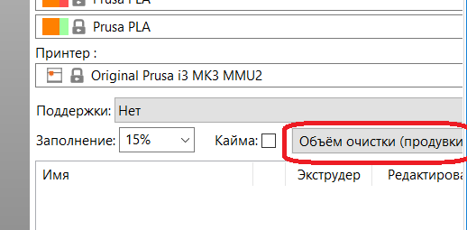

# Localization and translation guide

The purpose of this guide is to describe how to contribute to the PrusaSlicer translations. 
Please use PoEdit (https://poedit.net) for editing translations.

### Scenario 1. How do I add a translation or fix an existing translation
1. Get PO-file from corresponding folder here:
https://github.com/prusa3d/PrusaSlicer/tree/master/resources/localization
2. Open this file in PoEdit as "Edit a translation"
3. Apply your corrections to the translation
4. Push changed PrusaSlicer.po and PrusaSlicer.mo (will create automatically after saving of PrusaSlicer.po in PoEdit) into the original folder.

### Scenario 2. How do I add a new language support
1. Get file PrusaSlicer.pot here :
https://github.com/prusa3d/PrusaSlicer/tree/master/resources/localization
2. Open it in PoEdit for "Create new translation"
3. Select Translation Language (for example French).
4. As a result you will have fr.po - the file containing translation to French.
Notice. When the translation is complete you need to:
    - Rename the file to PrusaSlicer.po
    - Click "Save file" button. PrusaSlicer.mo will be created immediately
    - Both PrusaSlicer.po and PrusaSlicer.mo have to be saved here:
https://github.com/prusa3d/PrusaSlicer/tree/master/resources/localization/fr
( name of folder "fr" means "French" - the translation language). 

### Scenario 3. How do I add a new text resource when implementing a feature to PrusaSlicer
Each string resource in PrusaSlicer available for translation needs to be processed by one of next localization functions:
```C++
// Mark, do NOT translate
inline const std::string& L(const std::string& s);

// Mark, do NOT translate
inline const std::string& L_CONTEXT(const std::string& s, const std::string& ctx);

// Translate, do NOT mark.
extern std::string _u8(const std::string& s);

// Mark and translate.
inline std::string _u8L(const std::string& s);

// Translate, do NOT mark.
extern std::string _ctx_u8(const std::string& s, const std::string& ctx);

// Mark and translate.
inline std::string _ctx_u8L(const std::string& s, const std::string& ctx);

// Mark and translate.
extern std::string _L_PLURAL_u8(const std::string& single, const std::string& plural, int n);
```


## General guidelines for PrusaSlicer translators


- We recommend using *PoEdit* application for translation (as described above). It will help you eliminate most punctuation errors and will show you strings with "random" translations (if the fuzzy parameter was used).

- To check how the translated text looks on the UI elements, test it :) If you use *PoEdit*, all you need to do is save the file. At this point, a MO file will be created. Rename it PrusaSlicer.mo, and you can run PrusaSlicer (see above).

- If you see an encoding error (garbage characters instead of Unicode) somewhere in PrusaSlicer, report it. It is likely not a problem of your translation, but a bug in the software.

- See on which UI elements the translated phrase will be used. Especially if it's a button, it is very important to decide on the translation and not write alternative translations in parentheses, as this will significantly increase the width of the button, which is sometimes highly undesirable:



- If you decide to use autocorrect or any batch processing tool, the output requires very careful proofreading. It is very easy to make it do changes that break things big time.

- **Any formatting parts of the phrases must remain unchanged.** For example, you should not change `%1%` to `%1 %`, you should not change `%%` to `%` (for percent sign) and similar. This will lead to application crashes.

- Please pay attention to spaces, line breaks (\n) and punctuation marks. **Don't add extra line breaks.** This is especially important for parameter names.

- Description of the parameters should not contain units of measurement. For example, "Enable fan if layer print time is less than ~~n seconds~~"

- For units of measurement, use the international system of units. Use "s" instead of "sec".

- If the phrase doesn't have a dot at the end, don't add it. And if it does, then don't forget to :)

- It is useful to stick to the same terminology in the application (especially with basic terms such as "filament" and similar). Stay consistent. Otherwise it will confuse users.

- Please note that the generated `.po` file may already contain translated strings (usually merged from the upstream wxWidgets dictionaries).

- **Please do not modify these translations.** Any changes to them will be reverted during the next synchronization.

- **How to check whether a string comes from wxWidgets:**

1. Select the phrase you want to modify.
2. Click **View -> Show Code Occurrences**.
3. In the dialog that opens, check the file path. If it does **not** contain any variation of **`Slic3r`**, the string most likely comes from wxWidgets, so please leave it unchanged.


