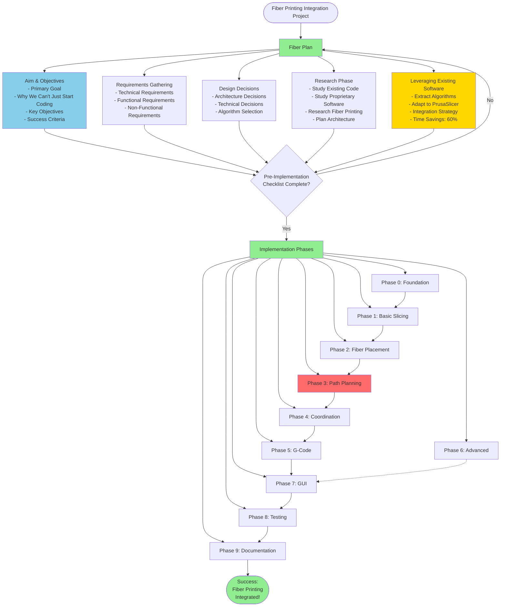

# Fiber 3D Printing Implementation Roadmap

## Overview

This roadmap breaks down the implementation of fiber-specific slicing logic into PrusaSlicer, following the versatile architecture pattern (similar to how SLA was added).

---

## 📋 Fiber Plan

### Visual Overview



### 🎯 Aim & Objectives

### Primary Goal
**Integrate proprietary continuous fiber reinforcement slicing logic into PrusaSlicer**, creating a versatile, extensible system that can generate G-code for fiber 3D printers while maintaining compatibility with the existing PrusaSlicer architecture.

### Why We Can't Just Start Coding

Before writing a single line of code, we must:

1. **Understand the Requirements**
   - What does the existing proprietary software do?
   - What are the exact G-code commands your printer uses?
   - What are the constraints and limitations?
   - What are the success criteria?

2. **Understand the Existing System**
   - How does PrusaSlicer's architecture work?
   - How was SLA integrated? (Use as template)
   - What can we reuse? What must be new?
   - Where are the integration points?

3. **Design the Architecture**
   - How will fiber printing fit into the existing system?
   - What interfaces need to be created?
   - How will it be extensible and maintainable?
   - What are the data structures needed?

4. **Plan the Implementation**
   - What are the dependencies between components?
   - What order should things be built?
   - What are the risks and mitigation strategies?
   - How will we test and validate?

### Key Objectives

#### Technical Objectives
- ✅ **Modularity**: Create a separate, self-contained fiber printing module (like SLA)
- ✅ **Reusability**: Leverage existing FFF slicing where possible
- ✅ **Extensibility**: Design for future requirements and different fiber types
- ✅ **Compatibility**: Work seamlessly with existing PrusaSlicer features
- ✅ **Performance**: Efficient path planning and G-code generation

#### Functional Objectives
- ✅ **Pattern Support**: Multiple fiber placement patterns (grid, concentric, custom)
- ✅ **Path Planning**: Generate continuous, collision-free fiber paths
- ✅ **Coordination**: Proper sequencing of plastic and fiber printing
- ✅ **G-Code Output**: Generate valid G-code for your specific printer
- ✅ **User Control**: Configurable settings for all fiber parameters

#### Quality Objectives
- ✅ **Reliability**: Robust error handling and validation
- ✅ **Maintainability**: Clean, well-documented, testable code
- ✅ **Usability**: Intuitive GUI and clear documentation
- ✅ **Versatility**: Support different printers, fiber types, and use cases

### Success Criteria

**Minimum Viable Product (MVP) Success:**
- Can slice a 3D model into layers
- Can place fiber strands in a basic pattern (e.g., grid)
- Can generate continuous fiber paths without collisions
- Can output G-code that your printer accepts and executes correctly
- Basic GUI for configuring fiber settings
- Works with at least one fiber type (e.g., carbon fiber)

**Full Success:**
- Multiple fiber placement patterns work correctly
- Advanced features implemented (stress analysis, custom paths, etc.)
- Polished GUI with 3D visualization
- Comprehensive documentation
- Thoroughly tested and validated on real printer
- Extensible for future requirements

### Requirements Gathering (Pre-Implementation)

Before Phase 0, you must gather:

#### 1. Technical Requirements
- [ ] **Printer Specifications**
  - What G-code commands does your printer use for fiber?
  - What are the fiber head specifications (speed, pressure, etc.)?
  - What are the printer's physical limits (bed size, Z height, etc.)?
  
- [ ] **Fiber Specifications**
  - What fiber types need to be supported? (Carbon, Glass, Kevlar, etc.)
  - What are the fiber properties? (diameter, strength, etc.)
  - What are the constraints? (min/max curvature, tension, etc.)
  
- [ ] **Existing Software Analysis**
  - How does your proprietary software work?
  - What algorithms does it use?
  - What are its inputs and outputs?
  - What are its limitations?

#### 2. Functional Requirements
- [ ] **User Needs**
  - What patterns do users need? (grid, concentric, custom, etc.)
  - What level of control do users need?
  - What are common use cases?
  
- [ ] **Integration Requirements**
  - Must it work with existing FFF features? (supports, infill, etc.)
  - What GUI features are needed?
  - What file formats must be supported?

#### 3. Non-Functional Requirements
- [ ] **Performance**
  - How fast must path planning be?
  - What's the maximum model complexity?
  
- [ ] **Reliability**
  - What error handling is needed?
  - What validation is required?
  
- [ ] **Usability**
  - Who are the users? (technical level)
  - What documentation is needed?

### Design Decisions Needed (Before Coding)

#### Architecture Decisions
- [ ] **Module Structure**: How to organize the code? (Follow SLA pattern?)
- [ ] **Data Structures**: How to represent fiber paths? Layers? Patterns?
- [ ] **Algorithm Selection**: Which path planning algorithm? (Your proprietary one?)
- [ ] **Integration Points**: Where to hook into existing code?

#### Technical Decisions
- [ ] **Path Planning Strategy**: 
  - Continuous paths only? Or allow breaks?
  - How to handle complex geometries?
  - How to optimize path length?
  
- [ ] **Pattern System**:
  - How to make patterns extensible?
  - Plugin system? Or hardcoded?
  
- [ ] **G-Code Generation**:
  - How to integrate with existing G-code writer?
  - Custom commands? Or standard?
  
- [ ] **GUI Integration**:
  - New tabs? Or extend existing?
  - How to visualize fiber paths?

### Research Phase (Before Phase 0)

#### 1. Study Existing Code
- [ ] Read and understand `SLAPrint.hpp/cpp` thoroughly
- [ ] Read and understand `PrintBase.hpp` (base interface)
- [ ] Study `SLAPrintSteps.cpp` (processing pipeline)
- [ ] Understand `PrintConfig.hpp` (configuration system)
- [ ] Review GUI integration (`src/slic3r/GUI/`)

#### 2. Study Your Proprietary Software ⭐ **KEY ADVANTAGE**
- [ ] **Document existing algorithms** - You already have working code!
- [ ] **Identify reusable components** - What can be ported directly?
- [ ] **Identify what needs to be adapted** - What needs PrusaSlicer integration?
- [ ] **Understand the data flow** - How does your software work?
- [ ] **Extract core algorithms** - Separate business logic from UI/platform code
- [ ] **Map to PrusaSlicer structures** - How do your data structures map to PrusaSlicer's?
- [ ] **Identify integration points** - Where does your logic fit into PrusaSlicer?

#### 3. Research Fiber Printing
- [ ] Study existing fiber printing solutions (Markforged, Anisoprint, etc.)
- [ ] Understand best practices
- [ ] Research path planning algorithms
- [ ] Study G-code standards for fiber

#### 4. Plan Architecture
- [ ] Design class hierarchy
- [ ] Design data structures
- [ ] Design interfaces
- [ ] Create architecture diagrams
- [ ] Document design decisions

### Pre-Implementation Checklist

Before starting Phase 0, ensure:

- [ ] ✅ Requirements are documented
- [ ] ✅ Architecture is designed
- [ ] ✅ Existing code is understood
- [ ] ✅ Proprietary algorithms are analyzed
- [ ] ✅ Printer specifications are known
- [ ] ✅ G-code commands are documented
- [ ] ✅ Design decisions are made
- [ ] ✅ Integration strategy is clear
- [ ] ✅ Testing strategy is planned
- [ ] ✅ Success criteria are defined

### Risk Mitigation

**Key Risks:**
1. **Algorithm Complexity**: Path planning is complex
   - *Mitigation*: Prototype early, validate with simple cases first

2. **Integration Challenges**: Fitting into existing architecture
   - *Mitigation*: Follow SLA pattern closely, study it thoroughly

3. **Printer Compatibility**: G-code might not work
   - *Mitigation*: Test with real printer early, iterate quickly

4. **Performance**: Large models might be slow
   - *Mitigation*: Profile early, optimize critical paths

5. **Maintenance**: Code might become hard to maintain
   - *Mitigation*: Follow PrusaSlicer coding standards, document well

---

### 💡 Leveraging Existing Proprietary Software

### Why This Makes It Easier

Since you already have **proprietary software that generates G-code for fiber printers**, you have significant advantages:

#### ✅ **What You Already Have:**
1. **Proven Algorithms** - Your path planning logic is already working
2. **Validated Logic** - You know what works and what doesn't
3. **G-Code Generation** - You know the exact commands your printer needs
4. **Pattern Implementations** - Your patterns are already tested
5. **Edge Case Handling** - You've already solved many problems
6. **Performance Optimization** - Your code is likely already optimized

#### ✅ **What This Means:**
- **Less Research** - You don't need to figure out algorithms from scratch
- **Faster Development** - Port existing code rather than write new
- **Lower Risk** - Proven algorithms reduce risk of failure
- **Better Quality** - Battle-tested code is more reliable
- **Clearer Requirements** - You know exactly what needs to be built

### Migration Strategy

#### Phase 1: Extract & Understand
1. **Analyze Your Proprietary Software**
   - What are the core algorithms?
   - What are the data structures?
   - What are the dependencies?
   - What is UI-specific vs core logic?

2. **Identify Reusable Components**
   - Path planning algorithms → Can be ported
   - Pattern generators → Can be ported
   - G-code generation → Can be adapted
   - Validation logic → Can be reused

3. **Identify Integration Points**
   - Where does your code need PrusaSlicer data?
   - Where does PrusaSlicer need your output?
   - What interfaces need to be created?

#### Phase 2: Adapt to PrusaSlicer Architecture
1. **Refactor for Integration**
   - Separate core logic from UI/platform code
   - Create PrusaSlicer-compatible interfaces
   - Adapt data structures to PrusaSlicer types
   - Remove platform-specific dependencies

2. **Map Data Structures**
   - Your layer format → PrusaSlicer's `Layer` class
   - Your path format → PrusaSlicer's `ExtrusionPath` or custom
   - Your config → PrusaSlicer's `FiberPrintConfig`

3. **Create Adapters**
   - Adapter to convert PrusaSlicer data → Your algorithm input
   - Adapter to convert Your algorithm output → PrusaSlicer data

#### Phase 3: Integration
1. **Wrap Your Algorithms**
   - Create C++ wrappers if needed (if your code is in different language)
   - Create PrusaSlicer-compatible interfaces
   - Integrate into `FiberPrint` class

2. **Replace G-Code Generation**
   - Adapt your G-code writer to PrusaSlicer's format
   - Integrate with existing G-code pipeline
   - Maintain compatibility with your printer

### Example Migration Path

```
Your Proprietary Software:
┌─────────────────────────────────┐
│  UI Layer (can be discarded)    │
├─────────────────────────────────┤
│  Path Planning Algorithm ✅     │ → Extract & Port
│  Pattern Generator ✅            │ → Extract & Port
│  G-Code Writer ✅                │ → Adapt
│  Validation Logic ✅             │ → Reuse
└─────────────────────────────────┘

PrusaSlicer Integration:
┌─────────────────────────────────┐
│  PrusaSlicer GUI                │
├─────────────────────────────────┤
│  FiberPrint (new)                │
│  ├─ Your Path Planning ✅       │ ← Ported
│  ├─ Your Pattern Generator ✅   │ ← Ported
│  └─ Adapted G-Code Writer ✅    │ ← Adapted
└─────────────────────────────────┘
```

### What Still Needs Work

Even with existing software, you still need to:

1. **Architecture Integration** (Medium effort)
   - Fit into PrusaSlicer's architecture
   - Follow PrusaSlicer patterns (like SLA)
   - Create proper interfaces

2. **Data Structure Adaptation** (Medium effort)
   - Convert between your formats and PrusaSlicer's
   - May need to refactor some code
   - Create adapters

3. **GUI Integration** (Medium effort)
   - Create PrusaSlicer GUI panels
   - Integrate settings
   - Add visualization

4. **Testing & Validation** (Ongoing)
   - Test integration
   - Validate with PrusaSlicer models
   - Ensure compatibility

### Estimated Time Savings

**Without Existing Software:**
- Algorithm development: 4-6 weeks
- Path planning: 3-4 weeks
- Pattern generation: 2-3 weeks
- G-code generation: 2 weeks
- **Total: 11-15 weeks**

**With Existing Software:**
- Algorithm porting: 1-2 weeks
- Path planning adaptation: 1-2 weeks
- Pattern adaptation: 1 week
- G-code integration: 1 week
- **Total: 4-6 weeks** ⚡ **~60% time savings!**

### Key Success Factors

1. **Clean Separation** - Separate core logic from UI/platform code
2. **Good Documentation** - Document your algorithms well
3. **Modular Design** - Make it easy to extract components
4. **Test Coverage** - Have tests for your algorithms
5. **Clear Interfaces** - Well-defined inputs/outputs

### Action Items for Leveraging Existing Software

- [ ] **Document your algorithms** - Write down how they work
- [ ] **Identify core components** - What's reusable?
- [ ] **Create extraction plan** - How to separate logic from UI?
- [ ] **Map data structures** - How do they map to PrusaSlicer?
- [ ] **Plan integration** - Where does it fit?
- [ ] **Create test cases** - Use your existing software's test cases
- [ ] **Document G-code format** - What commands does your printer use?

---

### Phase 0: Foundation & Architecture Setup

### Goal: Create the basic structure for fiber printing

**Tasks:**
- [ ] Study `SLAPrint.hpp/cpp` and `SLAPrintSteps.hpp/cpp` in detail
- [ ] Create `FiberPrint.hpp` - Main fiber print class (extends `PrintBase`)
- [ ] Create `FiberPrint.cpp` - Basic implementation
- [ ] Create `FiberPrintSteps.hpp` - Define processing steps
- [ ] Create `FiberPrintSteps.cpp` - Step implementations
- [ ] Create `src/libslic3r/Fiber/` directory structure
- [ ] Add `FiberPrintConfig` to `PrintConfig.hpp`
- [ ] Integrate with CMake build system

**Deliverables:**
- Basic `FiberPrint` class that compiles
- Empty processing pipeline structure
- Configuration system for fiber settings

**Estimated Time:** 1-2 weeks

---

### Phase 1: Basic Slicing Integration

### Goal: Reuse existing slicing, add fiber layer structure

**Tasks:**
- [ ] Integrate with existing FFF slicing (`PrintObject::slice()`)
- [ ] Create `FiberLayer` class to store fiber data per layer
- [ ] Create `FiberPath` class to represent individual fiber strands
- [ ] Store sliced layers in `FiberPrint` object
- [ ] Add layer-by-layer data structure for fiber placement

**Deliverables:**
- Can slice model into layers (reusing FFF logic)
- Data structures ready to hold fiber path information
- Each layer knows its geometry and can accept fiber paths

**Estimated Time:** 1 week

---

### Phase 2: Fiber Placement Strategy

### Goal: Determine WHERE to place fiber strands

**Tasks:**
- [ ] **2.1: Layer Selection Logic**
  - [ ] Decide which layers need fiber (every layer? every N layers?)
  - [ ] Add config option: `fiber_layer_interval`
  - [ ] Add config option: `fiber_start_layer`, `fiber_end_layer`
  
- [ ] **2.2: Pattern Selection**
  - [ ] Implement grid pattern generator
  - [ ] Implement concentric pattern generator
  - [ ] Implement custom pattern support (user-defined)
  - [ ] Add config option: `fiber_pattern` (enum)
  
- [ ] **2.3: Direction/Angle Control**
  - [ ] Implement angle-based path generation (0°, 45°, 90°, custom)
  - [ ] Support per-layer angle changes
  - [ ] Add config option: `fiber_angle`
  - [ ] Add config option: `fiber_angle_per_layer` (array)
  
- [ ] **2.4: Density Control**
  - [ ] Calculate spacing between fiber strands
  - [ ] Add config option: `fiber_spacing`
  - [ ] Add config option: `fiber_density` (percentage)
  
- [ ] **2.5: Placement Zones**
  - [ ] Support fiber only in specific regions (perimeter, infill, both)
  - [ ] Add config option: `fiber_placement_zone`
  - [ ] Implement region detection (perimeter vs infill)

**Deliverables:**
- `FiberPlacement.hpp/cpp` - Decides where fibers go
- Multiple pattern generators (grid, concentric, custom)
- Configurable placement strategy

**Estimated Time:** 2-3 weeks

---

### Phase 3: Continuous Path Generation

### Goal: Generate continuous, collision-free fiber paths

**Tasks:**
- [ ] **3.1: Path Planning Algorithm**
  - [ ] Implement continuous path generation (no retractions)
  - [ ] Handle path start/end points
  - [ ] Ensure paths don't cross or overlap incorrectly
  - [ ] Create `ContinuousPath.hpp/cpp`
  
- [ ] **3.2: Collision Detection**
  - [ ] Check for collisions with part geometry
  - [ ] Check for collisions with other fiber paths
  - [ ] Check for collisions with printer limits
  - [ ] Implement path validation
  
- [ ] **3.3: Path Optimization**
  - [ ] Minimize travel moves
  - [ ] Optimize path order (shortest path problem)
  - [ ] Group paths by direction for efficiency
  - [ ] Implement path smoothing
  
- [ ] **3.4: Multi-Layer Path Continuity**
  - [ ] Plan paths that can connect between layers
  - [ ] Support continuous fiber across multiple layers
  - [ ] Handle layer transitions smoothly

**Deliverables:**
- `PathPlanner.hpp/cpp` - Generates continuous paths
- `ContinuousPath.hpp/cpp` - Path data structure
- Collision-free path generation
- Optimized path ordering

**Estimated Time:** 3-4 weeks (core algorithm complexity)

---

### Phase 4: Plastic-Fiber Coordination

### Goal: Coordinate when to print plastic vs fiber

**Tasks:**
- [ ] **4.1: Print Sequence Strategy**
  - [ ] Implement "plastic-first" mode (print all plastic, then fiber)
  - [ ] Implement "alternating" mode (plastic layer → fiber layer → repeat)
  - [ ] Implement "fiber-on-top" mode (fiber immediately after each plastic layer)
  - [ ] Add config option: `fiber_print_sequence`
  
- [ ] **4.2: Layer Timing**
  - [ ] Calculate when to start fiber after plastic
  - [ ] Handle cooling time requirements
  - [ ] Add config option: `fiber_delay_after_plastic`
  
- [ ] **4.3: Integration with FFF Pipeline**
  - [ ] Hook into existing FFF print generation
  - [ ] Interleave fiber commands with plastic commands
  - [ ] Maintain proper layer ordering

**Deliverables:**
- `FiberPlasticCoordinator.hpp/cpp` - Coordinates printing sequence
- Multiple print sequence strategies
- Proper timing between plastic and fiber

**Estimated Time:** 1-2 weeks

---

### Phase 5: G-Code Generation

### Goal: Generate G-code commands for fiber printing

**Tasks:**
- [ ] **5.1: Fiber-Specific G-Code Commands**
  - [ ] Define fiber start command (e.g., `M106` or custom)
  - [ ] Define fiber stop command (e.g., `M107` or custom)
  - [ ] Define fiber speed control
  - [ ] Define fiber pressure/tension control
  - [ ] Research your printer's specific commands
  
- [ ] **5.2: G-Code Writer**
  - [ ] Create `FiberGCodeWriter` class
  - [ ] Generate standard FFF G-code (reuse existing)
  - [ ] Inject fiber commands at appropriate points
  - [ ] Handle tool changes (plastic nozzle → fiber head)
  
- [ ] **5.3: G-Code Formatting**
  - [ ] Format fiber paths as G-code moves
  - [ ] Add comments for readability
  - [ ] Add layer markers
  - [ ] Support different G-code flavors (Marlin, RepRap, custom)

**Deliverables:**
- `FiberGCode.hpp/cpp` - G-code generation
- Complete G-code file with plastic + fiber commands
- Configurable G-code flavor support

**Estimated Time:** 2 weeks

---

### Phase 6: Advanced Features

### Goal: Add sophisticated fiber placement strategies

**Tasks:**
- [ ] **6.1: Stress-Based Placement** (Optional)
  - [ ] Analyze model for stress points
  - [ ] Place more fiber in high-stress areas
  - [ ] Implement adaptive density
  - [ ] Add config option: `fiber_stress_analysis`
  
- [ ] **6.2: Custom Fiber Paths**
  - [ ] Allow user to draw/define custom paths
  - [ ] Support path import from external files
  - [ ] GUI tool for path editing
  
- [ ] **6.3: Multi-Fiber Support**
  - [ ] Support multiple fiber types in one print
  - [ ] Different fibers for different regions
  - [ ] Layer-by-layer fiber type selection
  
- [ ] **6.4: Fiber Anchoring**
  - [ ] Ensure fiber starts/ends are properly anchored
  - [ ] Add anchor points in plastic
  - [ ] Prevent fiber from pulling out

**Deliverables:**
- Advanced placement algorithms
- Custom path support
- Multi-fiber capabilities

**Estimated Time:** 3-4 weeks (optional features)

---

### Phase 7: GUI Integration

### Goal: Add user interface for fiber settings

**Tasks:**
- [ ] **7.1: Settings Panels**
  - [ ] Add fiber settings tab in print settings
  - [ ] Add fiber type selector (Carbon, Glass, Kevlar)
  - [ ] Add pattern selector
  - [ ] Add angle/direction controls
  - [ ] Add density/spacing controls
  
- [ ] **7.2: 3D Visualization**
  - [ ] Visualize fiber paths in 3D preview
  - [ ] Color-code fiber paths differently from plastic
  - [ ] Show fiber direction with arrows
  - [ ] Layer-by-layer fiber preview
  
- [ ] **7.3: Preview & Validation**
  - [ ] Show estimated print time
  - [ ] Show fiber usage (length, weight)
  - [ ] Validate fiber paths (warnings for issues)
  - [ ] Show path statistics

**Deliverables:**
- Complete GUI for fiber settings
- 3D visualization of fiber paths
- User-friendly configuration interface

**Estimated Time:** 2-3 weeks

---

### Phase 8: Testing & Validation

### Goal: Ensure reliability and correctness

**Tasks:**
- [ ] **8.1: Unit Tests**
  - [ ] Test path planning algorithms
  - [ ] Test pattern generation
  - [ ] Test collision detection
  - [ ] Test G-code generation
  
- [ ] **8.2: Integration Tests**
  - [ ] Test full print pipeline
  - [ ] Test with various models
  - [ ] Test edge cases (thin walls, overhangs, etc.)
  
- [ ] **8.3: Real Printer Testing**
  - [ ] Test generated G-code on actual printer
  - [ ] Validate fiber placement accuracy
  - [ ] Test different patterns and settings
  - [ ] Performance testing (large models)

**Deliverables:**
- Comprehensive test suite
- Validated G-code output
- Performance benchmarks

**Estimated Time:** 2-3 weeks

---

### Phase 9: Documentation & Polish

### Goal: Make it production-ready

**Tasks:**
- [ ] Write user documentation
- [ ] Write developer documentation
- [ ] Add code comments
- [ ] Create example configurations
- [ ] Create tutorial videos/docs
- [ ] Performance optimization
- [ ] Bug fixes and refinements

**Deliverables:**
- Complete documentation
- Polished, production-ready code

**Estimated Time:** 1-2 weeks

---

## Implementation Priority

### Must Have (Core Functionality):
1. ✅ Phase 0: Foundation
2. ✅ Phase 1: Basic Slicing
3. ✅ Phase 2: Fiber Placement (basic patterns)
4. ✅ Phase 3: Continuous Path Generation
5. ✅ Phase 4: Plastic-Fiber Coordination
6. ✅ Phase 5: G-Code Generation

### Should Have (Enhanced Usability):
7. ✅ Phase 7: GUI Integration (basic)
8. ✅ Phase 8: Testing

### Nice to Have (Advanced Features):
9. ⚪ Phase 6: Advanced Features
10. ⚪ Phase 7: GUI Integration (advanced visualization)
11. ⚪ Phase 9: Documentation & Polish

---

## Key Design Principles for Versatility

### 1. **Modular Architecture**
- Separate concerns: Placement, Path Planning, G-Code
- Easy to swap algorithms
- Easy to add new patterns

### 2. **Configuration-Driven**
- All behavior controlled by config options
- No hardcoded values
- User can customize everything

### 3. **Extensible Patterns**
- Plugin-like pattern system
- Easy to add new patterns
- Support custom/user-defined patterns

### 4. **Printer Agnostic**
- Abstract G-code generation
- Support multiple printer types
- Configurable command mapping

### 5. **Algorithm Flexibility**
- Multiple path planning strategies
- Pluggable algorithms
- Easy to integrate proprietary logic

---

## Estimated Total Timeline

### ⚠️ Without Existing Software (Reference)
**Minimum Viable Product (MVP):**
- Phases 0-5: **10-14 weeks** (2.5-3.5 months)

**Full Featured Version:**
- All Phases: **18-24 weeks** (4.5-6 months)

### ✅ With Existing Proprietary Software (Your Case) ⚡
**Minimum Viable Product (MVP):**
- Phases 0-5: **6-9 weeks** (1.5-2.25 months) - **~40% faster!**
  - Phase 0: 1 week (structure setup)
  - Phase 1: 1 week (slicing integration)
  - Phase 2: 1-2 weeks (port your pattern generators)
  - Phase 3: 2-3 weeks (port your path planning) ⭐ Biggest savings
  - Phase 4: 1 week (coordination)
  - Phase 5: 1 week (adapt your G-code writer)

**Full Featured Version:**
- All Phases: **12-16 weeks** (3-4 months) - **~35% faster!**

**With Advanced Features:**
- All Phases + Advanced: **16-20 weeks** (4-5 months) - **~30% faster!**

### Time Savings Breakdown

| Phase | Without Software | With Software | Savings |
|-------|------------------|---------------|---------|
| Phase 2 (Placement) | 2-3 weeks | 1-2 weeks | 1 week |
| Phase 3 (Path Planning) | 3-4 weeks | 2-3 weeks | 1 week |
| Phase 5 (G-Code) | 2 weeks | 1 week | 1 week |
| **Total Savings** | - | - | **3-4 weeks** |

---

## Critical Path Items

These are the most important and complex tasks:

1. **Continuous Path Generation** (Phase 3) - Core algorithm
2. **Path Planning Algorithm** (Phase 3) - Your proprietary logic
3. **G-Code Integration** (Phase 5) - Must work with your printer
4. **Plastic-Fiber Coordination** (Phase 4) - Timing is critical

---

## Next Steps

1. **Start with Phase 0** - Get the structure in place
2. **Prototype Phase 3** - Validate your path planning algorithm works
3. **Iterate** - Build incrementally, test frequently
4. **Integrate Early** - Don't wait until the end to test with real printer

---

## Notes

- **Reuse Existing Code**: Don't reinvent slicing - reuse FFF slicing
- **Start Simple**: Get basic grid pattern working first, then add complexity
- **Test Early**: Test with real printer as soon as G-code generation works
- **Be Flexible**: Design for extensibility from the start
- **Document As You Go**: Don't leave documentation until the end

---

## Success Criteria

✅ **MVP Success:**
- Can slice a model
- Can place fiber in grid pattern
- Can generate continuous paths
- Can output G-code that printer accepts
- Basic GUI for settings

✅ **Full Success:**
- Multiple patterns work
- Advanced features implemented
- GUI is polished
- Well documented
- Tested and validated

---

**Remember: Versatility means the system should handle:**
- Different fiber types
- Different patterns
- Different printers
- Different use cases
- Future requirements (extensible)

Good luck! 🚀

