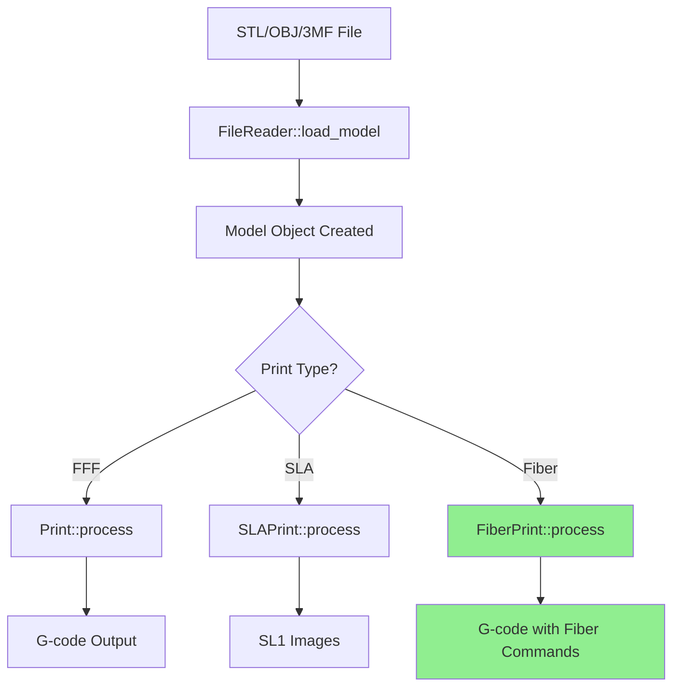
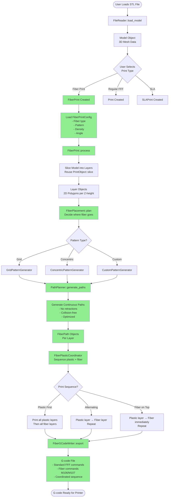
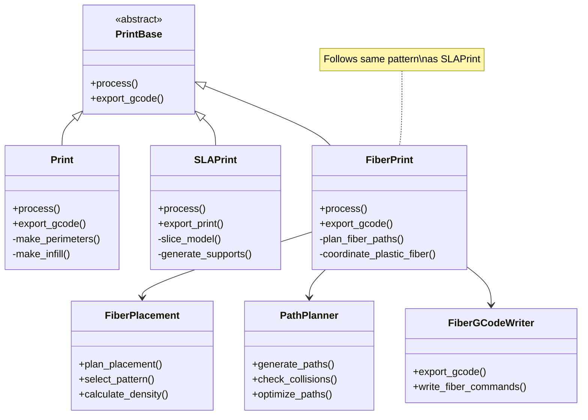
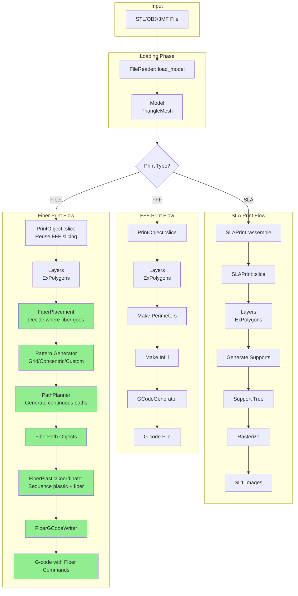
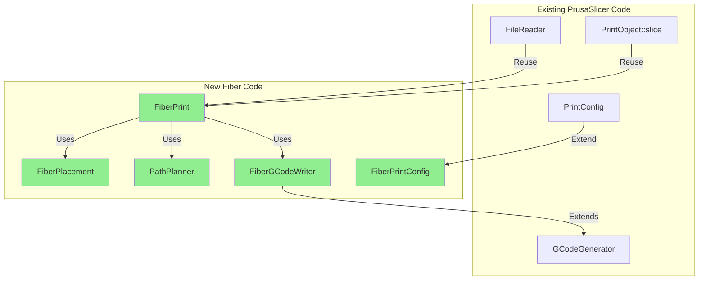
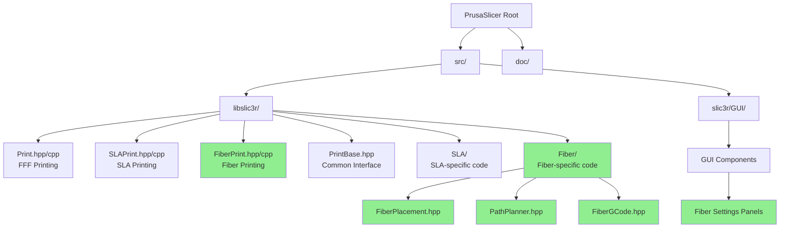
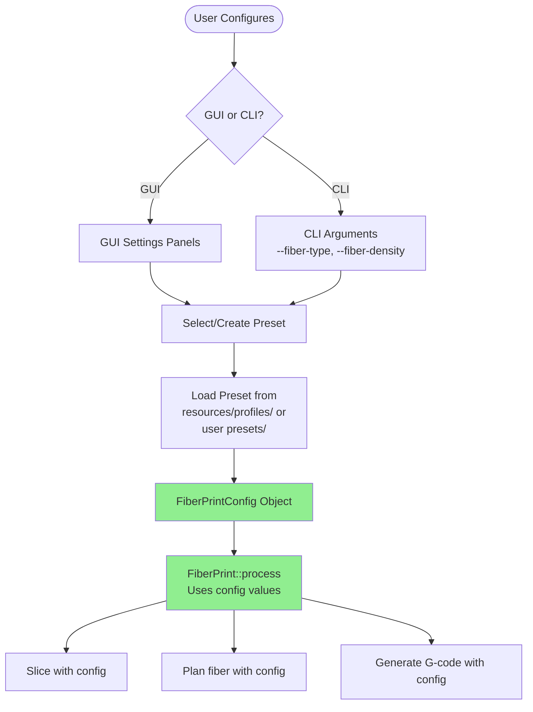
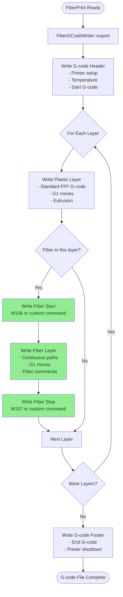

# Fiber Printing Integration Architecture

## Overview

This document shows how fiber printing integrates with PrusaSlicer's existing architecture, following the same pattern as SLA printing.

---

## High-Level Architecture Flow

---

## Detailed Fiber Integration Flow

---

## Class Hierarchy Integration

---

## Data Flow: STL to G-code (FFF, SLA, Fiber in Parallel)

---

## Integration Points with Existing Code

---

## Processing Steps Comparison

```mermaid
flowchart TD
    subgraph FFF["FFF Print Flow"]
        F1[Load Model]
        F2[Slice]
        F3[Make Perimeters]
        F4[Make Infill]
        F5[Export G-code]
        F1 --> F2 --> F3 --> F4 --> F5
    end
    
    subgraph SLA["SLA Print Flow"]
        S1[Load Model]
        S2[Assemble]
        S3[Slice]
        S4[Generate Supports]
        S5[Export SL1]
        S1 --> S2 --> S3 --> S4 --> S5
    end
    
    subgraph Fiber["Fiber Print Flow"]
        FB1[Load Model]
        FB2[Slice]
        FB3[Plan Fiber Placement]
        FB4[Generate Fiber Paths]
        FB5[Coordinate Plastic+Fiber]
        FB6[Export G-code with Fiber]
        FB1 --> FB2 --> FB3 --> FB4 --> FB5 --> FB6
    end
    
    style FB3 fill:#90EE90
    style FB4 fill:#90EE90
    style FB5 fill:#90EE90
    style FB6 fill:#90EE90
```

---

## File Structure Integration

---

## Configuration Flow

---

## G-code Generation Flow

---

## Key Integration Points

### 1. **Extends PrintBase** (Like SLA)
- `FiberPrint` extends `PrintBase`
- Implements required virtual methods
- Follows same interface pattern

### 2. **Reuses Existing Slicing**
- Uses `PrintObject::slice()` or similar
- Reuses layer generation logic
- Leverages existing mesh processing

### 3. **New Fiber-Specific Logic**
- `FiberPlacement` - Decides where fiber goes
- `PathPlanner` - Generates continuous paths
- `FiberGCodeWriter` - Outputs fiber commands

### 4. **Configuration System**
- Extends `PrintConfig` with `FiberPrintConfig`
- Uses preset system (INI files)
- Supports CLI arguments

### 5. **GUI Integration**
- New settings panels for fiber
- 3D visualization of fiber paths
- Preset management

---

## Summary

The fiber printing integration follows the **exact same pattern as SLA**:

1. ✅ **Separate Module**: `FiberPrint` class (like `SLAPrint`)
2. ✅ **Dedicated Directory**: `src/libslic3r/Fiber/` (like `SLA/`)
3. ✅ **Processing Steps**: `FiberPrintSteps` (like `SLAPrintSteps`)
4. ✅ **Configuration**: `FiberPrintConfig` (like `SLAPrintConfig`)
5. ✅ **G-code Output**: Custom G-code generation (like SLA's SL1 export)

The integration is **modular and non-intrusive** - it doesn't modify existing FFF code, just adds a new parallel system! 🎯

