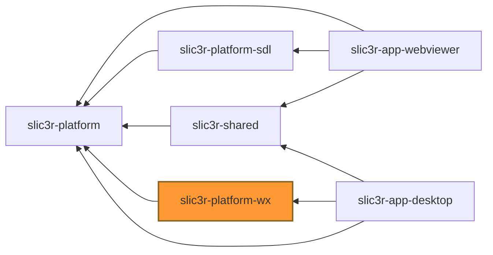

# slic3r-platform-wx

Implementation of [slic3r-platform](../slic3r-platform) runtime using wxWidgets library.
This implementation is intended to be used to implement full-featured desktop application 
using mix of imgui and wx GUI elements to get best of the both worlds.

## Expected inter-lib dependencies

