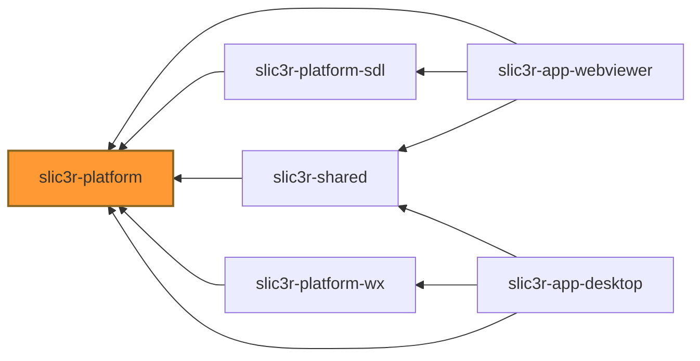

# slic3r-platform

Definition of cross-platform runtime interface with some shared infrastructure
in form of abstract classes. These classes are meant to provide:

- generic interface for _a render module_ (`AbstractRenderModule`) A module that
  - implements application module (like plater or G-Code preview) in cross-platform way, 
  - requires only OpenGL context ready for drawing scene,
  - uses ImGUI to render cross-platform UI,
  - consuming scene events (i.e. events not consumes by imgui GUI).
- generic runtime to provide runtime for the module (`AbstractRenderCanvas`) which provides:
  - generic interface for the runtime to host the rendering module,
  - abstract implementation of rendering and event loop handling sequence:
    - passing input events to ImGUI & begin imgui frame,
    - render imgui (by calling render module)
    - end imgui frame (pass events not consumed by ImGUI to render module as scene events)
    - begin scene frame
    - render scene frame (by calling render module)
    - end scene frame (swap buffers and present)

This library is intended to be used by:
- `slic3r-shared` or other slic3r related libs/apps to implement `AbstractRenderModule`s
- `slic3r-platform-sdl` and `slic3r-platform-wx` to implement `AbstractRenderCanvas` utilizing
  specific library to provide cross-platform runtime suitable for desktop app development (wx)
  or web app development (SDL w/ Emscripten).

Expected inter-lib dependencies:

