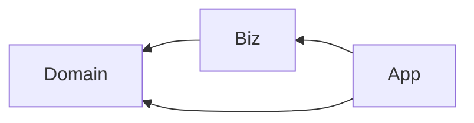
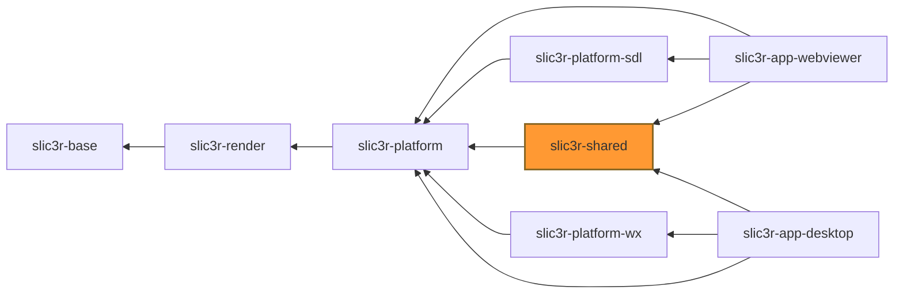

# slic3r-shared

This library contains all components/classes shared among slic3r applications 
that **are platform independent**.

## Layers and Clean architecture

This library is also split into three layers conforming [Clean Architecture](https://blog.cleancoder.com/uncle-bob/2012/08/13/the-clean-architecture.html).

- [`Slic3r::Domain`](src/Slic3r/Domain) Represents [domain model](https://en.wikipedia.org/wiki/Domain_model), i.e. a data model with some basic operations. 
  Most of the classes logically belonging to this layer are located in `libslic3r` (e.g. Model, ModleObject, ModelVolume, Print, PrintObject, 
  DynamicPrintConfig, ModelObjectConfig, etc.) 
- [`Slic3r::Biz`](src/Slic3r/Biz) Represents a use case layer (in Clean architecture terminology). Classes in this layer implements operations (i.e. `Interactor` 
  "pattern") but **do not** handle visual representation.
- [`Slic3r::App`](src/Slic3r/App) contains classes handling visual representation (i.e. `Presenter` pattern) and rest of app-specific logic. (Note that all 
  classes/components of this library are required to be platform-agnostic. The platform-specific implementation must be placed into app-specific module, e.g. `slic3r-app-desktop`)

To conform to the clean architecture only following interlayer dependencies are allowed:

In case when it seems an opposite direction dependency will be needed, use [the dependency inversion principle](https://en.wikipedia.org/wiki/Dependency_inversion_principle).

## Expected inter-lib dependencies

