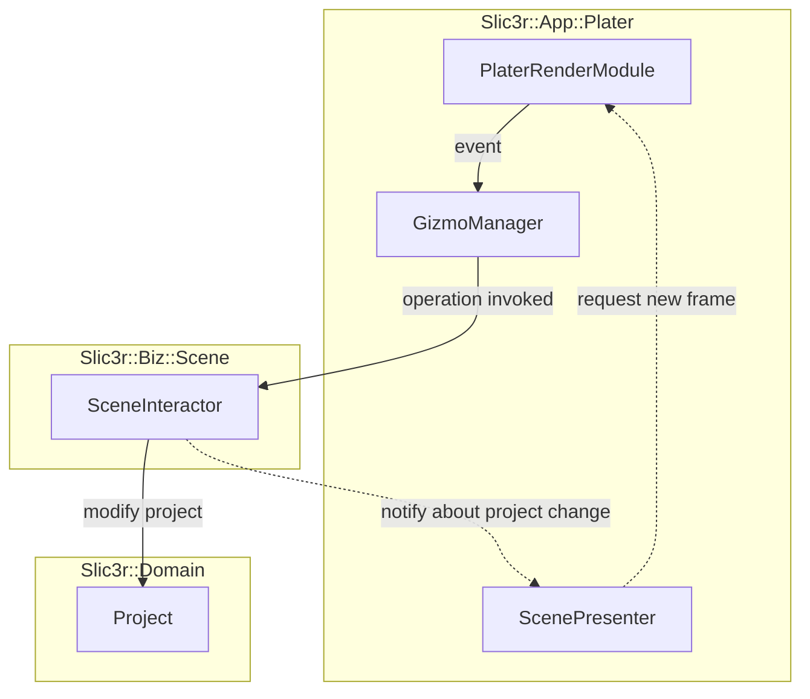
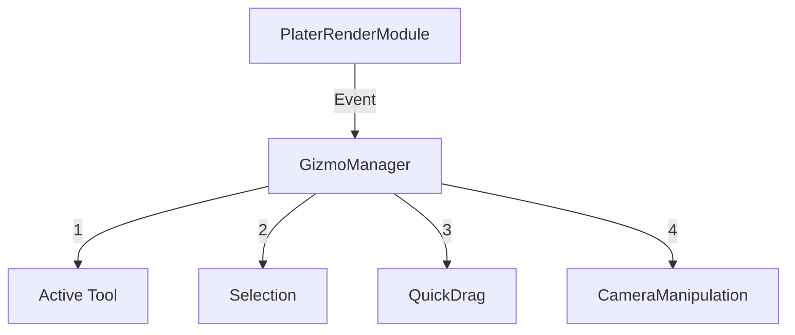

# Slic3r::App::Plater

This namespace accommodates complete plater application layer.

This is basic flow of interaction with _Project_ (or its part like Model) looks like this:

GizmoManager flow:

